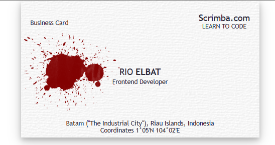

# Business Card

<p align="center">
  
</p>

## Description

This is a simple business card to learn about styling with CSS. I built this with only HTML and CSS without a framework.

## How to run it

1. Clone it with this command on your terminal.

```
git clone https://github.com/rioelbat/business-card.git
```

2. Open `business-card`folder
3. Run a simple http server with Python or Node

Python

```
python -m SimpleHTTPServer 8000
```

Python3

```
python3 -m http.server 8000
```

Node

```
npx http-server -p 8000
```
